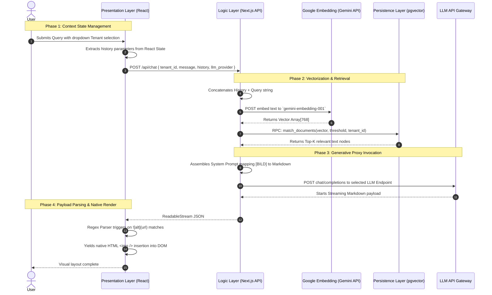

# ⚖️ Multimodal Legal RAG Prototype (StVO / StVG)

🌍 **[Deutsche Version unten](#-deutsche-version)**

## 1. Project Motivation & Problems Addressed

This project is an End-to-End Retrieval-Augmented Generation (RAG) Minimum Viable Product (MVP) aimed at answering complex legal queries based on the German Traffic Law (StVO/StVG). 

**The Challenge:** Traditional RAG systems struggle with multimodal documents (laws heavily reliant on traffic sign images). Passing thousands of images to Vision models for ingestion is financially exorbitant and critically slow. Furthermore, strict separation of legal domains (e.g., Traffic Law vs. Astrophysics) is required.

**The Solution:** This project introduces a decoupled architecture featuring **Regex Interception** for zero-cost localized multimodality, **Context Array Fusion** for conversational continuity, and **Dynamic Model Routing** via OpenRouter allowing prompt-level LLM switching without server redeployment.

---

## 2. Project Structure

```text
rag-prototype/
├── scripts/                    # Offline ETL Pipeline (Node.js/ESM)
│   ├── diagnose.mjs            # Connectivity & Dimension Validation
│   ├── ingest_universal.mjs    # Unified Ingestion: Strategy-based Parser
│   └── purge_stvo.mjs          # Data Purge: Tenant-specific truncation
├── src/
│   └── app/
│       ├── api/chat/route.ts   # Edge API: Contextual RAG & Proxy Controller
│       ├── globals.css         # UI Design System & Component Styling
│       └── page.tsx            # Client View: Regex-driven Image Intersection
├── public/                     # Static Assets
│   └── data/stvo/              # Multimodal Image Binary Assets (.jpg)
├── .env.local                  # Environment Configuration (Git-ignored)
├── package.json                # Dependency Manifest
└── README.md                   # System Architecture Documentation
```

---

## 3. Core Architecture & ETL Pipeline

The system enforces a strict separation of concerns between client rendering, edge API orchestration, and an offline Extract-Transform-Load (ETL) data pipeline.

### Chronological Request Flow (Sequence Diagram)



### The Offline ETL Pipeline (Ingestion)
Data extraction operates independently of the Next.js online runtime via `scripts/ingest_universal.mjs`:
1. **Extract**: Text is acquired via asynchronous file-system reads from raw XML structures (`stvo.xml`).
2. **Transform (DOM Parsing)**: Utilizing `cheerio`, distinct XML `<norm>` boundaries are targeted to chunk text precisely without sliding-window boundary shifts. `` tags are stripped and swapped with syntactic tags (e.g., `[VERKEHRSSCHILD_BILD: parking.jpg]`).
3. **Load (Batch Processing)**: Vector payloads are dynamically processed in maximum packages of 50 via Google's `batchEmbedContents`, leveraging an **Exponential Backoff Retry Engine** to mitigate `HTTP 429` API saturation. Data is pushed to Supabase checking for existing section hashes to enforce idempotency.

---

## 4. Setup & Run Instructions

To deploy this project locally on your machine, follow these steps:

### Prerequisites
- Node.js (v18+)
- A [Supabase](https://supabase.com/) account
- API Keys for Google Gemini and OpenRouter

### 1. Supabase Database Configuration
Execute the following SQL string in your Supabase SQL Editor to initialize the vector store and the RPC retrieval function:
```sql
-- Enable pgvector
CREATE EXTENSION IF NOT EXISTS vector;

-- Create table (uuid based, dimension-agnostic for scalability)
CREATE TABLE public.documents (
    id uuid PRIMARY KEY DEFAULT gen_random_uuid(),
    content text NOT NULL,
    metadata jsonb,
    embedding vector 
);

-- Enable Row Level Security (RLS)
ALTER TABLE public.documents ENABLE ROW LEVEL SECURITY;

-- Block unauthorized leakage, strictly tying tenant_id to active queries
CREATE POLICY tenant_isolation ON public.documents FOR SELECT TO anon 
USING (metadata->>'tenant_id' = current_setting('app.current_tenant', true));

-- RPC Function implementing Security Invoker for RLS obedience
CREATE OR REPLACE FUNCTION match_documents (
  query_embedding vector, match_threshold float, match_count int, filter_tenant_id text
) RETURNS TABLE (id uuid, content text, metadata jsonb, similarity float)
LANGUAGE plpgsql SECURITY INVOKER AS $$
BEGIN
  -- Inject the requested tenant into Postgres transaction context
  PERFORM set_config('app.current_tenant', filter_tenant_id, true);
  
  RETURN QUERY
  SELECT d.id, d.content, d.metadata, 1 - (d.embedding <=> query_embedding) as similarity
  FROM public.documents d
  WHERE 1 - (d.embedding <=> query_embedding) >= match_threshold
  ORDER BY d.embedding <=> query_embedding
  LIMIT match_count;
END;
$$;
```

### 2. Local Environment Setup
Clone the repository and install dependencies:
```bash
git clone <repository-url>
cd rag-prototype
npm install
```

Create a `.env.local` file in the root directory:
```env
NEXT_PUBLIC_SUPABASE_URL=your-supabase-url
NEXT_PUBLIC_SUPABASE_ANON_KEY=your-supabase-anon-key
SUPABASE_SERVICE_ROLE_KEY=your-supabase-service-key
GEMINI_API_KEY=your-google-gemini-key
OPENROUTER_API_KEY=your-openrouter-key
```

### 🗝️ Key Vault Breakdown
- **`NEXT_PUBLIC_SUPABASE_URL`**: The domain address of your database. Not a secret.
- **`NEXT_PUBLIC_SUPABASE_ANON_KEY`**: The "Guest Pass". Read by the Next.js API to query answers. Completely neutered by Postgres RLS, it cannot accidentally overwrite or destroy laws.
- **`SUPABASE_SERVICE_ROLE_KEY`**: The "God-Mode Pass". Bypasses all security firewalls. Never exposed to Next.js; strictly bound offline to `scripts/ingest_universal.mjs` for raw backend data loading.
- **`GEMINI_API_KEY`**: Senses semantics and builds Mathematical Vectors.
- **`OPENROUTER_API_KEY`**: The conversational linguistic broker.

### 3. Run the System
*(Optional)* If you wish to re-ingest the data pipeline:
```bash
node scripts/ingest_universal.mjs ./data/stvg.xml tenant-stvg
# 💡 Add --dry-run to test chunking & extraction locally without hitting the database or LLM API!
```

Start the Next.js development server:
```bash
npm run dev
```
Navigate to `http://localhost:3000`.

---

## 5. Key Design Choices & Technical Rationale

This MVP reflects deliberate architectural paradigms mapped directly to our Sequence Diagram:

### Phase 1: Context State Management
*   **Why rely on React state for `N-1 History` (Memory Context Fusion)?**
    Forcing conversational memory to operate entirely stateless on the Next.js backend drastically reduces database read/write volume. The UI client passes its history array in the HTTP body, mitigating Grammatical Coreferences (e.g. asking "What does *it* mean?") instantly without relying on rigid server-side JWT session architectures for MVP validation.

### Phase 2: Vectorization & Retrieval
*   **Why utilize `gemini-embedding-001` configured to 768 dimensions?**
    The 768-dimension structure identifies the established NLP industry sweet-spot. It is potent enough to parse complex legal semantics but avoids the crippling RAM loading delay triggered by >3000 dimension dots-products during search. We selected the legacy `gemini 001` explicitly for its massive offline batch-processing free limits.
*   **Why execute search logic via an RPC (`match_documents`) instead of pulling DB data into Next.js?**
    Maximum Network Efficiency. Vector matching requires assessing thousands of complex floats. Processing Cosine Distance limits (`<=>`) specifically within the native PostgreSQL extension avoids completely serializing massive vector records over HTTPS, returning only Top-K strings to the Node environment.

### Phase 3: Generative Proxy Invocation
*   **Why proxy generation through `OpenRouter` instead of querying LLMs natively from frontend?**
    Enforces a strict "Blind Generation" paradigm. By shifting request assembly strictly to the backend `route.ts`, the final generative LLM stays completely oblivious to the private structure of the retrieved Postgres chunks or System prompt instructions dictating Marker conversions. The user can switch the underlying foundation model (Gemini, Gemma, etc.) dynamically via the UI without requiring environment variable restarts or backend redeployments.

### Phase 4: Payload Parsing & Native Render
*   **Why intercept Output streams with `Regex` rather than relying on Vision LLM models natively?**
    Feeding hundreds of traffic sign images through a Vision LLM API is financially and computationally exorbitant, provoking heavy processing lag and risk of "hallucinations". By executing offline `[VERKEHRSSCHILD_BILD: xyz]` marker replacement within the XML Extraction process, the LLM treats images merely as text strings to output. Front-end React intercepts this pattern instantly—cutting the text stream and snapping physical image routes functionally local to the server. This yields 100% multimodality overhead-free.

---

## 6. Architectural Limitations & Boundaries

Due to execution constraints necessary for building an MVP, technical debts reside within this architecture model:

1. **Weak Namespace Isolation (Security)**: Retrieval namespace segmentation operates by relying on the client transmitting plaintext boundaries (`tenant_id`). While operationally acceptable for navigating open-source datasets, for production enterprise adoption, target `tenant_id` resolution must operate exclusively relying on validated cryptographic Session Tokens (JWT) passing contexts into backend Postgres RLS policies.
2. **Hardcoded Schema Limitations**: Database physical design strictly forces dimensions to 768 columns, binding persistence explicitly to the `gemini-embedding-001` constraints. Advancing capabilities (e.g., scaling to `text-embedding-3`) requires a destructive Database refactor.
3. **Naive Single-Stage Retrieval Fidelity**: Top-K responses rely comprehensively on straightforward nearest-neighbor Cosine Similarity comparisons without filtering. Advanced pipelines mandate standardizing a **Cross-Encoder Reranking** process immediately post-retrieval to evaluate semantic relation structures with high precision, eliminating "Lost in the Middle" LLM inaccuracies.

---
<br>

# 🇩🇪 Deutsche Version

## 1. Projektmotivation & Lösungsansatz

Dieses Projekt ist Minimum Viable Product (MVP) für ein End-to-End Retrieval-Augmented Generation (RAG) System, das komplexe rechtliche Fragen auf Basis der deutschen Straßenverkehrsordnung (StVO/StVG) beantwortet.

**Die Herausforderung:** Traditionelle RAG-Systeme scheitern an multimodalen Dokumenten (Gesetze, die stark von Abbildungen der Verkehrszeichen abhängen). Tausende Bilder über Vision-Modelle zu indexieren, ist finanziell exorbitant teuer und langsam. 

**Die Lösung:** Eine entkoppelte Architektur mit **Regex-Interception** für eine kostenlose, lokale Bild-Einbettung (Multimodalität), **Context-Fusion** (Gesprächshistorie) für kontextuelle Kontinuität und **Dynamic Model Routing** über OpenRouter, welches einen sofortigen Wechsel des LLMs direkt im Frontend ohne Backend-Neustart ermöglicht.

## 3. Projektstruktur

```text
rag-prototype/
├── scripts/                    # Offline ETL-Pipeline (Node.js/ESM)
│   ├── diagnose.mjs            # Konnektivitäts- und Dimensionsvalidierung
│   ├── ingest_universal.mjs    # Unified Ingestion: Strategiebasierter Parser
│   └── purge_stvo.mjs          # Datenbereinigung: Tenant-spezifische Löschung
├── src/
│   └── app/
│       ├── api/chat/route.ts   # Edge API: Kontextuelle RAG-Steuerung
│       ├── globals.css         # UI Design System & Component Styling
│       └── page.tsx            # Client View: Regex-gesteuerter Bild-Parser
├── public/                     # Statische Assets
│   └── data/stvo/              # Multimodale Bild-Binärdateien (.jpg)
├── .env.local                  # Umgebungsvariablen (Git-ignoriert)
└── README.md                   # Systemarchitektur-Dokumentation
```

## 4. Kernarchitektur & ETL-Pipeline

*(Hinweis: Das Sequenzdiagramm befindet sich im englischen Teil oben).*

### Die Offline ETL-Pipeline (Ingestion Script)
Die Datenaufbereitung operiert völlig unabhängig von der Next.js Serverumgebung über das Skript `scripts/ingest_universal.mjs`:
1. **Extract**: Text wird lokal aus rohen XML-Strukturen eingelesen (`stvg.xml`).
2. **Transform (DOM Parsing)**: Mithilfe von `cheerio` werden spezifische XML `<norm>` Grenzen exakt als RAG-Chunks extrahiert (verhindert das Verschieben von "Sliding Windows"). `` Tags werden entfernt und durch eindeutige Platzhalter ersetzt (z. B. `[VERKEHRSSCHILD_BILD: parking.jpg]`).
3. **Load (Batch Processing)**: Vektoren werden dynamisch in Paketen (max. 50 Chunks) über das `batchEmbedContents` Feature parallel generiert. Eine iterative **Exponential Backoff-Schleife** federt API Rate Limits (`429 Too Many Requests`) ab.

## 5. Setup & lokale Ausführung

### 1. Supabase Datenbank-Setup
Führe das folgende SQL-Skript im Supabase Query Editor aus, um die Vektordatenbank und die RPC-Funktion zu initialisieren:
*(Das SQL-Skript befindet sich im englischen Teil).*

### 2. Lokales Setup
Repository klonen und Node-Pakete installieren:
```bash
git clone <repository-url>
cd rag-prototype
npm install
```

Eine `.env.local` Datei im Hauptverzeichnis mit folgenden Schlüsseln anlegen:
```env
NEXT_PUBLIC_SUPABASE_URL=...
NEXT_PUBLIC_SUPABASE_ANON_KEY=...
SUPABASE_SERVICE_ROLE_KEY=...
GEMINI_API_KEY=...
OPENROUTER_API_KEY=...
```

### 3. System starten (Dev Server)
```bash
npm run dev
```
*(Die Applikation läuft jetzt auf http://localhost:3000).*

## 6. Kern-Designentscheidungen (Phasenbasiert)

Dieses MVP demonstriert kritische Technologie-Entscheidungen, referenziert auf das obige Sequenzdiagramm:

### Phase 1: Context State Management
*   **Warum basiert die `N-1 History` (Koreferenzauflösung) auf dem React State?**
    Die Verlagerung der Gesprächshistorie in den clientseitigen Payload löst Koreferenzfragen (z.B. Folgefragen wie "Und was ist damit gemeint?") augenblicklich auf. Es macht ein zustandsbehaftetes Serverprotokoll oder Session-Datenbanken für dieses zeitlich eingeschränkte MVP obsolet.

### Phase 2: Vectorization & Retrieval
*   **Warum die Nutzung von `gemini-embedding-001` mit 768 Dimensionen?**
    768 Dimensionen zentrieren sich im "Sweet Spot" der NPL-Performance. Es ist komplex genug für juristisches Vokabular, verbietet aber die extremen Auslastungsspitzen von 3000-dimensionalen Arrays bei Cosine-Berechnungen. Dies garantiert Latenzen im Millisekundenbereich. Die Auswahl dieses spezifischen Gemini Modells lag am generösen Free-Tier-Volumen für Massenverarbeitungen.
*   **Warum läuft die Vektormathematik isoliert in der `RPC: match_documents` Methode?**
    Um extreme Netzwerkeffizienzen zu generieren. Statt 10.000 generische Floating-Arrays durch das HTTPS-Nadelöhr in das Next.js Backend zu ziehen, um dort via Javascript zu sortieren, zwingt der Server die postgres-interne C++ Ebene via RPC, die Cosine Distanz (`<=>`) lokal auszuführen. Es fließen nur die 5 Textknoten durch das Kabel zurück.

### Phase 3: Generative Proxy Invocation
*   **Warum die Isolation der LLMs durch `OpenRouter`?**
    "Blind Generation" Design: Wir übermitteln dem ausführenden Generator ausschließlich saubere Textanweisungen. OpenRouter erlaubt es zudem, das finale Modell im Frontend ohne Zero-Day-Deployments jederzeit umzuschalten ("Hot-Swapping" von Gemini auf DeepSeek auf Llama).

### Phase 4: Payload Parsing & Native Render
*   **Warum das Abfangen der Ausgaben mit einer `Regex`-Logik anstelle der Nutzung nativer Vision LLMs?**
    Hunderte Verkehrszeichen in der Ingestion-Phase von echten KI-Augen dekonstruieren zu lassen führt zwangsläufig in den finanziellen Bankrott und treibt Latenzen ins Unermessliche. Indem unser ETL-Skript den XML `` Code durch reine Text-Anker (`[BILD...]`) austauscht, denken unsere LLMs, sie transferieren Texte. Das Frontend-React entdeckt (via Regex) diese Anweisungen im Millisekundentakt, kappt den Textstrang und mounted lokal abgelegte `.jpg` Dateien direkt im DOM. 100% Overhead-freie Multimodalität.

## 7. Architektonische Einschränkungen (Technical Debt)

Um dieses End-to-End System schnell zu iterieren, gibt es architektonische Schulden:

1. **Schwache Namespace-Sicherheit (RLS via Frontend)**: Aktuell wählt der Client den Tenant über das Plaintext-Parameter `tenant_id` (`POST`). Für öffentliche Lexika vertretbar, im Corporate/SaaS-Bereich muss eine zwingende serverseitige Begrenzung über kryptografische JWT-Session-Tokens eingeführt werden.
2. **Festgecodete Schema Mapping Limits**: Durch das physische Table-Limit von `vector(768)` in Postgres koppelt sich das System fest an das dedizierte `gemini-embedding-001`. Soll auf fähigere Modelle wie `text-embedding-3` migriert werden, wäre eine vollständige Neugenerierung und Schema-Anpassung nötig.
3. **Naive Recall Bias (Einphasen-Abruf)**: Das System vertraut bei den Top-K Treffern derzeit blind der reinen "Nearest-Neighbor" Distanz. Bei der Skalierung auf riesige Korpora ist im Backend ein nachgeschalteter **Cross-Encoder Reranker** (z. B. Cohere Rerank) unerlässlich, bevor der Kontext an das LLM geschickt wird.
